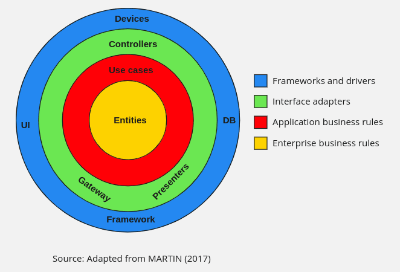

# TechChallenge Restaurante - Arquitetura

O projeto TechChallenge Restaurante é uma aplicação Java que utiliza a Clean Architecture para garantir uma separação clara entre lógica de negócios, interfaces e detalhes externos. Este README fornece uma visão detalhada da estrutura do projeto, explicando a organização das pastas e pacotes, e detalhando o funcionamento dos casos de uso.

## Estrutura do Projeto

A estrutura do projeto segue a Clean Architecture, dividindo o código em camadas independentes. Abaixo está a árvore de diretórios com uma explicação detalhada de cada parte:

## Clean Architecture



```plaintext
restaurante
├── application
│   ├── src
│   │   ├── main
│   │   │   └── java
│   │   │       └── com
│   │   │           └── fiap
│   │   │               └── techchallenge
│   │   │                   ├── controller
│   │   │                   │   ├── ClienteControllerImpl.java
│   │   │                   │   ├── inputdata
│   │   │                   │   ├── interfaces
│   │   │                   │   ├── mappers
│   │   │                   │   ├── PagSeguroCheckoutControllerImpl.java
│   │   │                   │   ├── PedidoControllerImpl.java
│   │   │                   │   └── ProdutoControllerImpl.java
│   │   │                   ├── external
│   │   │                   ├── gateway
│   │   │                   ├── helpers
│   │   │                   ├── Main.java
│   │   │                   ├── presenters
│   │   │                   ├── repository
│   │   │                   └── usecase
│   │   │
│   │   └── test
│   │       └── java
│   │           └── com
│   │               └── fiap
│   │                   └── techchallenge
│   │                       └── usecase
│   │                           └── ClienteUseCaseImplTest.java
│   └── pom.xml
├── domain
│   ├── src
│   │   ├── main
│   │   │   └── java
│   │   │       └── com
│   │   │           └── fiap
│   │   │               └── techchallenge
│   │   │                   ├── exceptions
│   │   │                   ├── Main.java
│   │   │                   └── model
│   │   │
│   │   └── test
│   │       └── java
│   │           └── com
│   │               └── fiap
│   │                   └── techchallenge
│   │                       └── model
│   │                           └── ClienteTests.java
│   └── pom.xml
├── infrastructure
│   ├── src
│   │   ├── main
│   │   │   ├── java
│   │   │   │   └── com
│   │   │   │       └── fiap
│   │   │   │           └── techchallenge
│   │   │   │               ├── adapters
│   │   │   │               │   ├── gateways
│   │   │   │               │   └── repositories
│   │   │   │               ├── config
│   │   │   │               ├── helpers
│   │   │   │               ├── mappers
│   │   │   │               ├── persistence
│   │   │   │               └── TechChallengeApplication.java
│   │   └── test
│   │       └── java
│   │           └── com
│   │               └── fiap
│   │                   └── techchallenge
│   │                       ├── adapters
│   │                       ├── mappers
│   │                       └── persistence
│   └── pom.xml
├── all_kubernetes.sh
├── docker-compose.yml
├── Dockerfile
├── kubernetes
│   ├── app-deployment.yaml
│   ├── app-service.yaml
│   ├── configmap.yaml
│   ├── db-deployment.yaml
│   ├── db-pvc.yaml
│   ├── db-secret.yaml
│   ├── db-service.yaml
│   └── secret.yaml
├── KUBERNETES_README.md
├── mvnw
├── mvnw.cmd
├── pom.xml
├── README-FLUXO-PEDIDO.md
├── README.md
├── run.sh
└── scan_sonarqube.sh
```

### Descrição dos Pacotes e Pastas

#### 1. **Domain**

**Pacote `domain`**:
- **`exceptions`**: Define exceções específicas do domínio, que são usadas para lidar com erros na lógica de negócios.
- **`model`**: Contém as entidades principais do domínio, que representam o núcleo da aplicação, como `Cliente`, `Pedido`, `Produto`, etc. Estas entidades são usadas em toda a aplicação e não devem depender de detalhes externos.

**Objetivo**: O domínio é a camada mais interna e isolada, contendo a lógica de negócios fundamental. Não deve depender de outras camadas.

#### 2. **Application**

**Pacote `application`**:
- **`controller`**: Implementa os controladores que recebem e processam as solicitações. Exemplos incluem `ClienteControllerImpl`, `PedidoControllerImpl`, `ProdutoControllerImpl`, e `PagSeguroCheckoutControllerImpl`. Cada controlador lida com um conjunto específico de endpoints.
- **`external`**: Contém a implementação de interfaces externas, como APIs e serviços de terceiros.
- **`gateway`**: Define interfaces para interagir com os serviços externos e persistência de dados.
- **`helpers`**: Fornece utilitários e funções auxiliares para a aplicação.
- **`presenters`**: Responsável pela formatação da saída para os clientes.
- **`repository`**: Define interfaces de repositórios que são implementadas pela camada de infraestrutura.
- **`usecase`**: Contém os casos de uso que orquestram a lógica de aplicação, chamando as operações do domínio e interagindo com a camada de infraestrutura. Exemplo: `ClienteUseCaseImpl`.

**Objetivo**: A camada de aplicação coordena os casos de uso e interage com o domínio. Define como a aplicação deve funcionar sem se preocupar com detalhes de implementação externa.

#### 3. **Infrastructure**

**Pacote `infrastructure`**:
- **`adapters`**: Implementações concretas das interfaces definidas na camada de aplicação. Subdividido em:
   - **`gateways`**: Implementações de interfaces que interagem com sistemas externos.
   - **`repositories`**: Implementações de repositórios que lidam com a persistência de dados.
- **`config`**: Contém arquivos de configuração para o sistema, como configurações de banco de dados e propriedades de aplicação.
- **`helpers`**: Utilitários específicos da infraestrutura.
- **`mappers`**: Responsável pela conversão entre entidades de domínio e modelos de persistência.
- **`persistence`**: Implementações específicas para acesso e manipulação de dados persistidos.
- **`TechChallengeApplication.java`**: Classe principal que inicializa a aplicação.

**Objetivo**: A camada de infraestrutura lida com a implementação concreta dos detalhes externos, como persistência de dados e comunicação com APIs. Implementa as interfaces definidas pela camada de aplicação.

### Detalhamento dos Casos de Uso

Os casos de uso representam as operações principais que a aplicação deve suportar. Estão localizados no pacote `application/usecase` e são responsáveis por coordenar a lógica de aplicação, interagindo com o domínio e a infraestrutura. Cada caso de uso deve:

- **Receber**: Dados necessários para a operação.
- **Processar**: Executar a lógica de aplicação.
- **Comunicar**: Interagir com o domínio e infraestrutura.
- **Retornar**: Produzir um resultado ou resposta para o controlador.

### Testes

Os testes são organizados para cobrir todas as camadas:
- **Domain**: Testes unitários das entidades e lógica de negócios.
- **Application**: Testes de casos de uso e controladores.
- **Infrastructure**: Testes de adaptadores e persistência.

### Configuração e Execução

- **Configuração do Projeto**: Utilize `pom.xml` para gerenciar dependências e configuração de build.
- **Docker**: Utilize `Dockerfile` e `docker-compose.yml` para construir e executar containers.
- **Kubernetes**: Configurações para deployment e serviços estão localizadas na pasta `kubernetes`.

### SWAGGER
Acesse:
http://localhost:8080/swagger-ui/index.html#/

Se executar pelo kubernetes:
http://192.168.49.2:31098/swagger-ui/index.html

## Participantes do projeto

[Douglas Gomes](https://github.com/dogdyzero)        &nbsp;&nbsp;&nbsp;&nbsp;&nbsp;&nbsp;&nbsp; RM354960    
[Robson Costa](https://github.com/robsonx4)          &nbsp;&nbsp;&nbsp;&nbsp;&nbsp;&nbsp;&nbsp;&nbsp;&nbsp;&nbsp; RM354332   
[Rodrigo Santiago](https://github.com/rodrigo-sntg)  &nbsp;&nbsp;&nbsp;&nbsp;&nbsp; RM354960  # template-cleanarch
